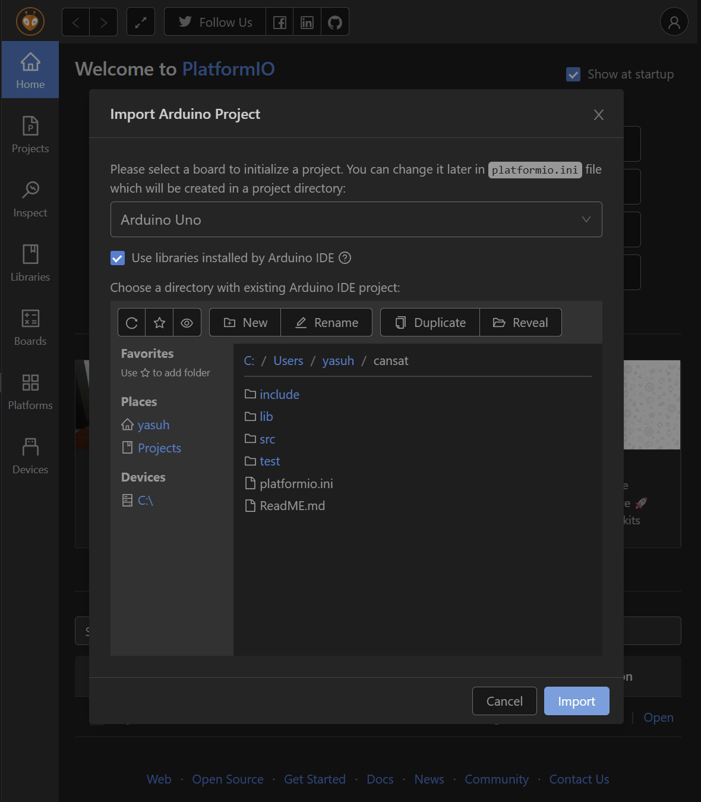

# CanSat Arduino 制御システム

このプロジェクトは、Arduino Unoを用いたCanSat（模擬人工衛星）自律移動ロボットの制御システム.GPS,IMU（加速度・ジャイロ・地磁気）,気圧センサを使い,目標地点に向かって自律的に移動する.

## ビルド・書き込み方法

1. VScodeの拡張機能にc/c++,PlatformIO IDEダウンロード
2. PIO Homeが勝手に開かれるので,Import Arduino Projectを開く
3. select a boardでarduino UNOを選択、下のチェック欄もクリック,このCANSATを選択した状態で右下のimportを押下

*注意点*
1. ダウンロードやimportしても実行できない、エラーが発生する場合があるがVScodeを再起動すると直る(閉じてまた開くだけ)　多分
2. PIO Homeが勝手に開かれない場合は左側の縦列にあるアリマークを押し,OPENを開く.

## 実行方法

1. ctrl+@を入力でターミナルを出す.
2. ctrl+alt+bで実行.
3. 右上にプラグマークがあるのでそれを押す.それか、ctrl+alt+sを押しシリアルモニターを出す
4. ctrl+cで終了

## 構成ファイル

- `include/GPSSensor.h`  
  GPSセンサ（TinyGPS++/SoftwareSerial）による位置情報取得クラス
- `include/IMUSensor.h`  
  IMUセンサ（MPU6050/LIS3MDL）による加速度・ジャイロ・地磁気取得クラス
- `include/BarometerSensor.h`  
  気圧センサ（LPS331AP）による気圧・高度取得クラス
- `include/ServoController.h`  
  サーボモータ制御クラス（目標方位に向けて左右サーボを制御）
- `src/GPSSensor.cpp`  
  GPSセンサクラスの実装
- `src/IMUSensor.cpp`  
  IMUセンサクラスの実装
- `src/BarometerSersor.cpp`  
  気圧センサクラスの実装
- `src/ServoController.cpp`  
  サーボ制御クラスの実装
- `src/main.cpp`  
  メイン処理（各センサの初期化・データ取得・サーボ制御）

## 主な機能

- GPSで現在位置を取得し、目標地点（例：中京大学八事キャンパス）までの方位・距離を計算
- IMUで現在の方位・加速度・ジャイロ情報を取得
- 気圧センサで高度や気圧の安定性を監視
- サーボモータで進行方向を制御し、目標地点へ誘導
- 各センサ値や制御状態をシリアル出力

## 動作環境

- Arduino Uno
- 各種センサ（GPS, MPU6050, LIS3MDL, LPS331AP）
- サーボモータ（左右）
---
